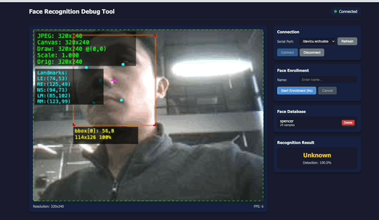

# tflm_face_embedding

Face Embedding 应用 - 使用 SCRFD + MobileFaceNet 进行人脸检测和 128 维特征提取。

## Demo



*Web 调试工具实时演示：人脸检测 + 关键点 + 特征提取 + 身份识别*

## 功能特点

- **人脸检测**: SCRFD-500M-KPS 多尺度检测 + 5 点关键点
- **人脸对齐**: 基于关键点的仿射变换对齐
- **特征提取**: MobileFaceNet 128D embedding (99.25% LFW)
- **实时输出**: JPEG 图像 + 检测框 + embedding 向量

## 模型规格

| 模型 | 输入尺寸 | 输出 | NPU 加速 | SRAM |
|------|----------|------|----------|------|
| SCRFD-500M-KPS | 160x160 RGB | Bbox + 5 landmarks | 100% | 220 KB |
| MobileFaceNet (foamliu) | 112x112 RGB | 128D embedding | 100% | 1200 KB |

**精度**: MobileFaceNet 在 LFW 数据集达到 99.25%

## Flash 地址

| 模型 | 地址 | 大小 |
|------|------|------|
| SCRFD | 0x200000 | ~600 KB |
| MobileFaceNet | 0x400000 | ~1.2 MB |

## 快速开始

### 1. 编译

```bash
# 确认 makefile 中 APP_TYPE = tflm_face_embedding
cd EPII_CM55M_APP_S
gmake clean && gmake -j$(nproc)
```

### 2. 烧录

```bash
# 使用一键脚本（推荐）
./build_and_flash.sh

# 或手动烧录
cd we2_image_gen_local
./we2_local_image_gen_macOS_arm64 project_case1_blp_wlcsp.json

python3 ../xmodem/xmodem_send.py \
  --port=/dev/tty.usbmodem* \
  --baudrate=921600 \
  --file=output_case1_sec_wlcsp/output.img \
  --model="model_zoo/tflm_face_embedding/scrfd/models/scrfd_500m_kps_int8_vela.tflite 0x200000 0x0" \
  --model="model_zoo/tflm_face_embedding/foamliu_mobilefacenet_128d/foamliu_mobilefacenet_128d_qat_int8_vela.tflite 0x400000 0x0"
```

### 3. 调试工具

项目提供 Web 调试工具，支持实时预览、人脸注册和识别：

```bash
cd tools/face_recognition_debug
uv run python backend/main.py

# 打开浏览器访问 http://localhost:4242
```

详见 [tools/face_recognition_debug/README.md](../../../tools/face_recognition_debug/README.md)

## 配置参数

**文件:** `common_config.h`

### 检测参数

| 参数 | 默认值 | 说明 |
|------|--------|------|
| `FACE_CONF_THRESHOLD` | 0.70 | 人脸检测置信度阈值 |
| `FACE_NMS_THRESHOLD` | 0.4 | NMS IoU 阈值 |
| `MIN_FACE_SIZE` | 40 | 最小人脸尺寸（像素）|

### 姿态过滤

| 参数 | 默认值 | 说明 |
|------|--------|------|
| `MAX_YAW_ANGLE` | 45.0 | 左右旋转限制（度）|
| `MAX_PITCH_ANGLE` | 45.0 | 上下旋转限制（度）|
| `MAX_ROLL_ANGLE` | 45.0 | 平面旋转限制（度）|
| `MIN_FACE_QUALITY` | 0.3 | 最小质量分数 |

### 人脸对齐

| 参数 | 默认值 | 说明 |
|------|--------|------|
| `ENABLE_FACE_ALIGNMENT` | 1 | 启用基于关键点的对齐 |

## 调试模式

### DEBUG_DETECTION_ONLY

仅运行人脸检测，跳过 embedding 模型。用于调试检测效果。

**文件:** `cvapp_face_embedding.cpp`

```c
/* 0 = 正常模式 (检测 + embedding) */
/* 1 = 仅检测模式 (跳过 embedding，发送所有检测到的人脸) */
#define DEBUG_DETECTION_ONLY 0
```

### DEBUG_VERBOSE

控制日志详细程度。

```c
/* 0 = 最小日志 (仅 timing 总结) */
/* 1 = 正常日志 (step timing + 关键信息) */
/* 2 = 详细日志 (所有调试信息) */
#define DEBUG_VERBOSE 0
```

### FRAME_CHECK_DEBUG

启用帧检查调试，发送 JPEG 图像到主机。

**文件:** `common_config.h`

```c
/* 1 = 启用 (发送 JPEG 帧) */
/* 0 = 禁用 */
#define FRAME_CHECK_DEBUG 1
```

### DBG_APP_LOG

启用应用层事件日志。

```c
/* 1 = 启用事件日志 */
/* 0 = 禁用 */
#define DBG_APP_LOG 0
```

## 输出协议

固件通过 UART (921600 baud) 发送 JSON 数据：

```json
{
  "type": 1,
  "name": "FACE_RESULT",
  "code": 0,
  "data": {
    "image": "<base64_jpeg>",
    "resolution": [640, 480],
    "faces": [{
      "bbox": [x, y, w, h],
      "confidence": 0.95,
      "landmarks": [[x1,y1], [x2,y2], [x3,y3], [x4,y4], [x5,y5]],
      "embedding": [0.1, 0.2, ..., 0.05]
    }]
  }
}
```

**Landmarks 顺序**: 左眼、右眼、鼻尖、左嘴角、右嘴角

## 内存布局

```
SRAM1 (0x340E0000, 1.125 MB tensor arena):
├── SCRFD arena:        220 KB
└── MobileFaceNet arena: 1200 KB
    总计:                1420 KB
```

## 与其他应用的对比

| 特性 | tflm_face_embedding | tflm_fd_fm |
|------|---------------------|------------|
| 检测模型 | SCRFD-500M-KPS | SCRFD |
| Embedding 模型 | MobileFaceNet 128D | 无 |
| 输出维度 | 128D | N/A |
| 主要用途 | 人脸识别 | 人脸检测 |
| SRAM 需求 | 1420 KB | ~220 KB |

## 模型文件

```
model_zoo/tflm_face_embedding/
├── scrfd/
│   └── models/
│       ├── scrfd_500m_kps_int8_vela.tflite    # NPU 优化版
│       └── scrfd_500m_kps_int8.tflite         # 原始 INT8
└── foamliu_mobilefacenet_128d/
    ├── foamliu_mobilefacenet_128d_qat_int8_vela.tflite  # NPU 优化版
    └── foamliu_mobilefacenet_128d_qat_int8.tflite       # 原始 INT8
```

## 相关文档

- [Face Recognition Debug Tool](../../../tools/face_recognition_debug/README.md) - Web 调试工具
- [Model Conversion Guide](../../../model_zoo/tflm_face_embedding/README.md) - 模型转换说明
- [SCRFD Decoding](../../../model_zoo/tflm_face_embedding/SCRFD_DECODING.md) - SCRFD 后处理说明
